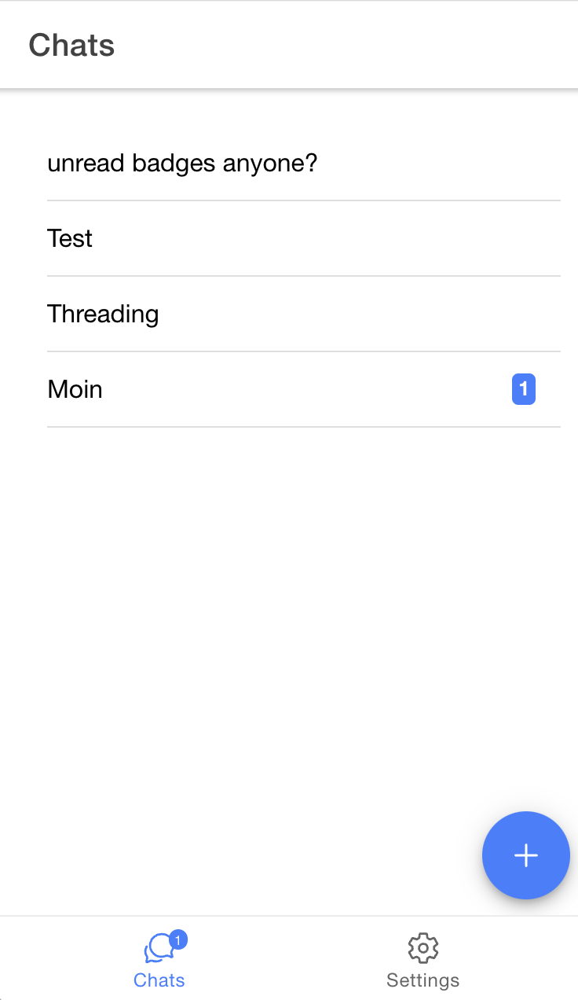
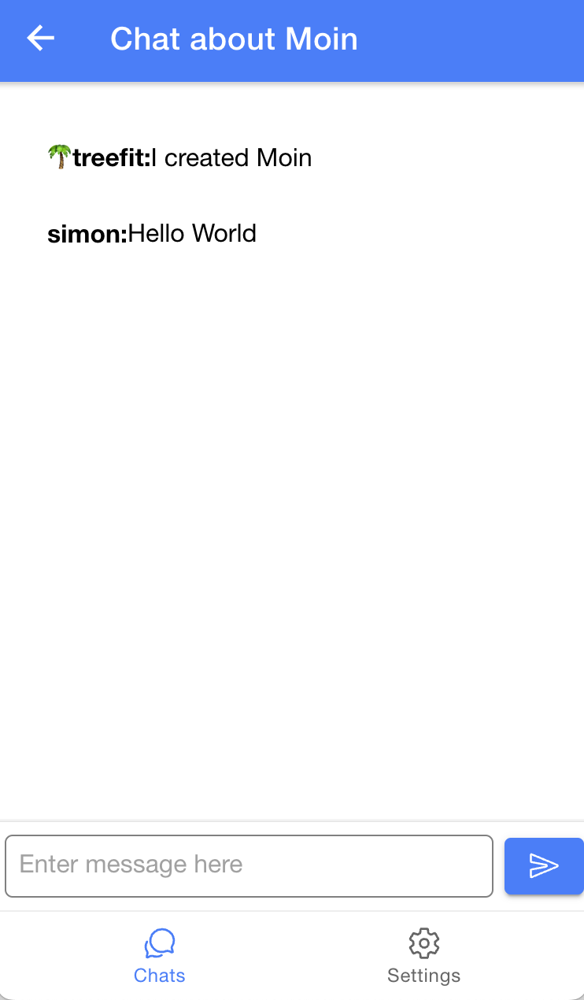

# Webxdc starter chat example with Ionic Framework and React

## Features

- Chat about multiple Topics in one webxdc
- Unread bages using localstorage
- Automatic Dark- and Light-Theme
- Automatic and Switchable Android / iOS Theme

## Screenshots




## Usage

install dependencies:
```
yarn
```

test in browser:
```
yarn dev
```

build:
```
yarn build
```

> Hint: If you just want to quickly try it out you could use github codespaces.
